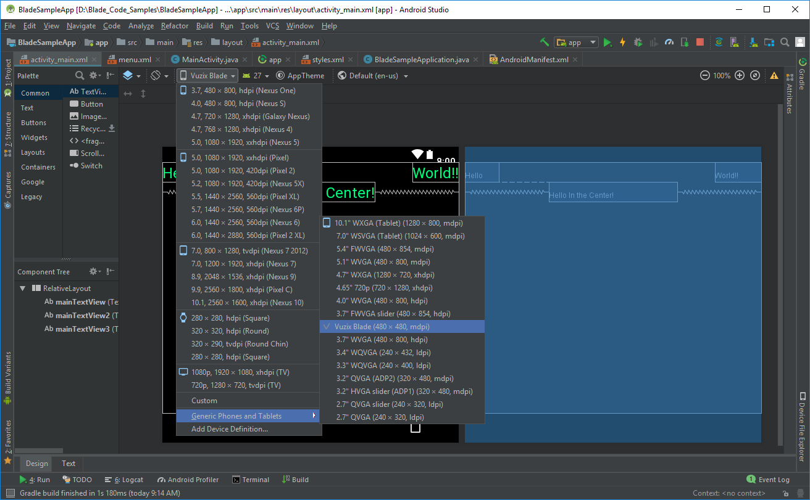

# HeadsUpGlass
Android app framework for smart glasses (a clone of private repo [NIPGlass](https://github.com/NUS-HCILab/NIPGlass))
- A server to communicate with clients
- Support RESTful APIs, Web Sockets or BLE to communicate with clients/devices/sensors/actuators
- Initially this was built for the Vuzix Blade smart glasses. Later modified to support any smart glasses running on Android (tested with Android 5.1 and 6)
- Depending on the display resolution, adjust your (Android) Activities
- If you have any questions or found any bugs, feel free to create a issue

## Related Publications
- [EYEditor: Towards On-the-Go Heads-Up Text Editing Using Voice and Manual Input](https://doi.org/10.1145/3313831.3376173), CHI'20, See [Eyeditor](https://github.com/NUS-HCILab/Eyeditor)
- [Ubiquitous Interactions for Heads-Up Computing: Understanding Users’ Preferences for Subtle Interaction Techniques in Everyday Settings](https://doi.org/10.1145/3447526.3472035), MobileHCI'21

## Documentation
- See [Logical Design](https://docs.google.com/document/d/1gdXW0ksE7j95bPe-f9ssFdg3P_WM-jFo96uOsl2pjFU/view?usp=sharing) to understand the architecture and APIs
- See the [guide](guide) directory for code samples
- If you want connect with mobile phone, use [NIPMobile](https://github.com/NUS-HCILab/NIPMobile)

## Contact person
- [Nuwan Janaka](https://www.nus-hci.org/team/nuwan-janaka/) ([In](https://www.linkedin.com/in/nuwan-janaka/))

## Requirements
1. AndroidStudio (or any IDE which support Android)
2. Android SDK (AndroidStudio will directly download this for you)

## How to run?
1. Build the project first (Make Tool)
2. Run the app
3. If you get error saying that `credential` file missing, add an empty json file (i.e. `credential.json` with content `{}`) to `res/raw/`

### Change app name
- Open `app/build.gradle` file and change the value of `applicationId` (e.g. From 'com.hci.nip.glass' to ''com.hci.nip.<APP_NAME>')
- Open `values/strings.xml` and change the value of `app_name` (e.g. From 'HeadsUpGlass' to '<APP_NAME>')

### Adding speech-to-text Google API
    - Create a directory called "raw" inside "res" directory
    - Create a file "credential.json" inside it (i.e. "res/raw/credential.json")
    - Copy the content from Google speech-to-text API credentials to the file (or add "{}" if you do not need it)

### Installing 3rd party APK files (not recommended)
- Not all APKs are supported by Vuzix Blade compared to Epson BT-300
- For Epson, just copy the APK file to the smart glasses and open it via file manager to install
- For any Android device connected to a computer (with Android SDK) in Debug mode
    - Go to the `platform-tools` in Android SDK (`cd C:\Users\<USER>\AppData\Local\Android\Sdk\platform-tools>`)
    - Install using `adb` (`adb install -r apk_file_name.apk`)

## Setup for Vuzix Blade
1. Open "AVD Manager" under the "Tools" menu and choose to "Create Virtual Device."
2. Choose the "Import Hardware Profiles"  and select the 'vuzix-blade_v3.xml' file in 'profile' directory of this project
3. Search for Vuzix and see if the new Device "Vuzix Blade" is added under the Phone Tab.
4. Close the "AVD Manager" (you may have to "Cancel" the setup during the process since it does not have virtual emulator) and restart the IDE.
5. Open/Import the project and open the "activity_main.xml" under 'res/layout' which shows the main layout of the project (i.e. MainActivity layout)
6. In the "Design" tab select "Vuzix Blade" as the profile as follows: 

## References
- Git model: https://nvie.com/posts/a-successful-git-branching-model/
- Android: https://developer.android.com/guide/components/fundamentals?hl=en, https://developer.android.com/courses/fundamentals-training/overview-v2
- Android architecture: https://developer.android.com/jetpack/docs/guide 
- Android context: https://blog.mindorks.com/understanding-context-in-android-application-330913e32514 
- Dagger: https://google.github.io/dagger/android.html, https://guides.codepath.com/android/dependency-injection-with-dagger-2
- RESTful API: https://github.com/NationalBankBelgium/REST-API-Design-Guide/wiki,  https://github.com/Microsoft/api-guidelines
- 3rd party icons used: 

